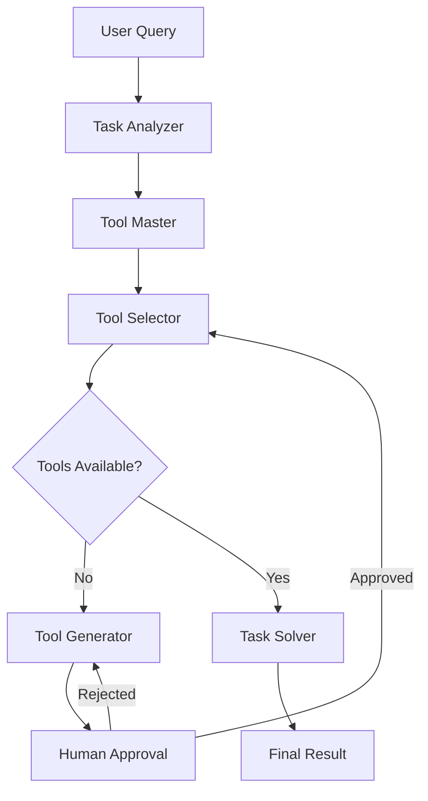

# LLM-Agent: Autonomous Tool Generation Framework

An intelligent multi-agent LLM pipeline that dynamically generates and executes custom tools based on user queries. This system combines LangGraph's state management with human-in-the-loop validation to create a robust, secure, and adaptive AI agent framework.

## 🌟 Key Features

- **Dynamic Tool Generation**: Automatically creates custom Python tools based on natural language queries
- **Human-in-the-Loop Validation**: Requires human approval before executing any generated code for security
- **Multi-Agent Architecture**: Uses specialized agents for different aspects of the task (analysis, tool selection, generation, execution)
- **Persistent Memory**: Maintains conversation state and tool availability across sessions
- **Pre-built Tool Library**: Includes ready-to-use tools for common tasks (weather, stocks, email extraction, etc.)
- **Local LLM Support**: Works with local LLM endpoints (tested with DeepSeek and Ollama)
- **Secure Execution**: Sandboxed tool execution with approval gates

## 🏗️ Architecture

The system consists of several specialized agents working together:

1. **Task Analyzer**: Breaks down user queries into manageable subtasks
2. **Tool Master**: Identifies what tools are needed for the task
3. **Tool Selector**: Checks availability of existing tools vs. need for new ones
4. **Tool Generator**: Creates new Python tools when needed
5. **Human Approval**: Validates generated tools before execution
6. **Task Solver**: Executes approved tools and provides final results



## 🚀 Quick Start

### Prerequisites

- Python 3.8+
- Access to a local LLM endpoint (Ollama, DeepSeek, etc.)
- API keys for external services (optional, for pre-built tools)

### Installation

1. **Clone the repository**:
   ```bash
   git clone <repository-url>
   cd advance-tool-learning
   ```

2. **Install dependencies**:
   ```bash
   pip install -r requirements.txt
   ```

3. **Set up environment variables**:
   ```bash
   cp .env.example .env
   # Edit .env with your LLM endpoint and API keys
   ```

4. **Configure your LLM**:
   ```env
   LLM_MODEL=your-model-name
   # Add other API keys as needed
   ```

### Basic Usage

**Command Line Interface**:
```bash
# Run with a query as arguments
python main.py "Calculate the sum of 15 and 27"

# Or run interactively
python main.py
```

**Programmatic Usage**:
```python
from graph import graph

# Create a config with thread ID
config = {"configurable": {"thread_id": "example_thread"}}

# Stream the execution
stream = graph.stream(
    {"messages": ["Your query here"], "max_turns": 5}, 
    config, 
    stream_mode="values"
)

for output in stream:
    if output is None:
        # Handle human approval
        human_input = {"human_approved": True, "human_feedback": ""}
        resume_stream = graph.stream(human_input, config, stream_mode="values")
        # Continue processing...
```

## 📚 Example Use Cases

### 1. **Data Analysis**
```
"Get Tesla's stock price for the last 30 days and create a visualization"
```
The system will:
- Generate a stock data fetching tool
- Create a visualization tool
- Ask for your approval
- Execute and display results

### 2. **Text Processing**
```
"Extract all email addresses from this text and convert them to uppercase"
```
The system will:
- Create an email extraction tool
- Add string manipulation functionality
- Process your text automatically

### 3. **API Integration**
```
"What's the weather in New York and how does it compare to London?"
```
The system will:
- Generate weather API integration tools
- Create comparison logic
- Fetch and analyze data from multiple sources

## 🛠️ Pre-built Tools

The system comes with several ready-to-use tools:

- **Stock Market Tools**: Alpha Vantage API integration, yfinance wrapper
- **Weather Tools**: OpenWeatherMap API integration
- **Text Processing**: Email extraction, string manipulation
- **Math Tools**: Basic arithmetic calculator
- **Web Search**: Bing, SerpAPI, Tavily integration
- **Visualization**: Matplotlib-based charting tools

## 🔧 Configuration

### LangGraph Configuration (`langgraph.json`)

```json
{
  "dependencies": ["."],
  "graphs": {
    "llm_agent": "./graph.py:graph",
    "tool_graph": "./tool_graph.py:graph"
  },
  "env": ".env",
  "version": "0.0.1",
  "langgraph": {
    "checkpointer": "memory",
    "memory_config": {"type": "inmem"}
  }
}
```

### Environment Variables

Create a `.env` file with:

```env
# LLM Configuration
LLM_MODEL=your-model-name
LLM_API_URL=http://localhost:11434/api/generate

# API Keys (Optional)
OPENWEATHER_API_KEY=your-key
ALPHA_VANTAGE_API_KEY=your-key
SERPAPI_API_KEY=your-key
TAVILY_API_KEY=your-key
```

## 🔒 Security Features

- **Human Approval Gate**: All generated tools require explicit user approval
- **Code Review Interface**: Generated code is displayed for manual inspection
- **Execution Isolation**: Tools run in controlled environments
- **API Key Management**: Secure handling of external service credentials

## 📁 Project Structure

```
advance-tool-learning/
├── main.py                 # CLI entry point
├── graph.py               # Main LangGraph workflow
├── tool_graph.py          # Alternative tool-focused workflow
├── requirements.txt       # Python dependencies
├── langgraph.json         # LangGraph configuration
├── data/
│   └── tool_config.json   # Pre-built tool definitions
├── evaluation/            # API integration examples
├── scraper/              # Web scraping utilities
├── temp/                 # Generated tool storage
└── utils/
    ├── nodes.py          # Agent node implementations
    ├── schema.py         # Data structures
    ├── prompts.py        # System prompts
    ├── router.py         # Conditional routing logic
    ├── tools.py          # Tool utilities
    ├── localllm.py       # Local LLM integration
    └── utility.py        # Helper functions
```

## 🎯 Advanced Usage

### Custom Tool Templates

Create custom tool templates in `data/tool_config.json`:

```json
{
  "name": "Custom_Tool_Name",
  "description": "Tool description",
  "is_available": true,
  "function": "# Python code here"
}
```

### Extending the Agent

Add new agent nodes in `utils/nodes.py`:

```python
def custom_agent(state: schema.State):
    # Your agent logic here
    return {"messages": [response]}
```

### Custom Routing Logic

Modify routing behavior in `utils/router.py`:

```python
def custom_router(state):
    # Your routing logic
    return "next_node_name"
```

## 🧪 Development

### Running Tests

```bash
# Run evaluation scripts
python evaluation/check_weather_OpenWeatherMap_API.py
python evaluation/stock_Alpha_Vantage_API.py
```

### Debugging

Enable debug mode by setting in your environment:

```env
DEBUG=true
LANGCHAIN_TRACING_V2=true
```

## 🤝 Contributing

1. Fork the repository
2. Create a feature branch (`git checkout -b feature/amazing-feature`)
3. Commit your changes (`git commit -m 'Add amazing feature'`)
4. Push to the branch (`git push origin feature/amazing-feature`)
5. Open a Pull Request

## 📄 License

This project is licensed under the MIT License - see the [LICENSE](LICENSE) file for details.

## 🙏 Acknowledgments

- Built with [LangGraph](https://github.com/langchain-ai/langgraph) for state management
- Powered by [LangChain](https://github.com/langchain-ai/langchain) for LLM integration
- Inspired by autonomous agent research and human-AI collaboration principles

## 📧 Support

If you encounter any issues or have questions:

1. Check the [Issues](https://github.com/your-repo/issues) page
2. Create a new issue with detailed information
3. Join our community discussions

---

**⚡ Quick Tip**: Start with simple queries like "add 5 and 10" to see the tool generation process in action!
